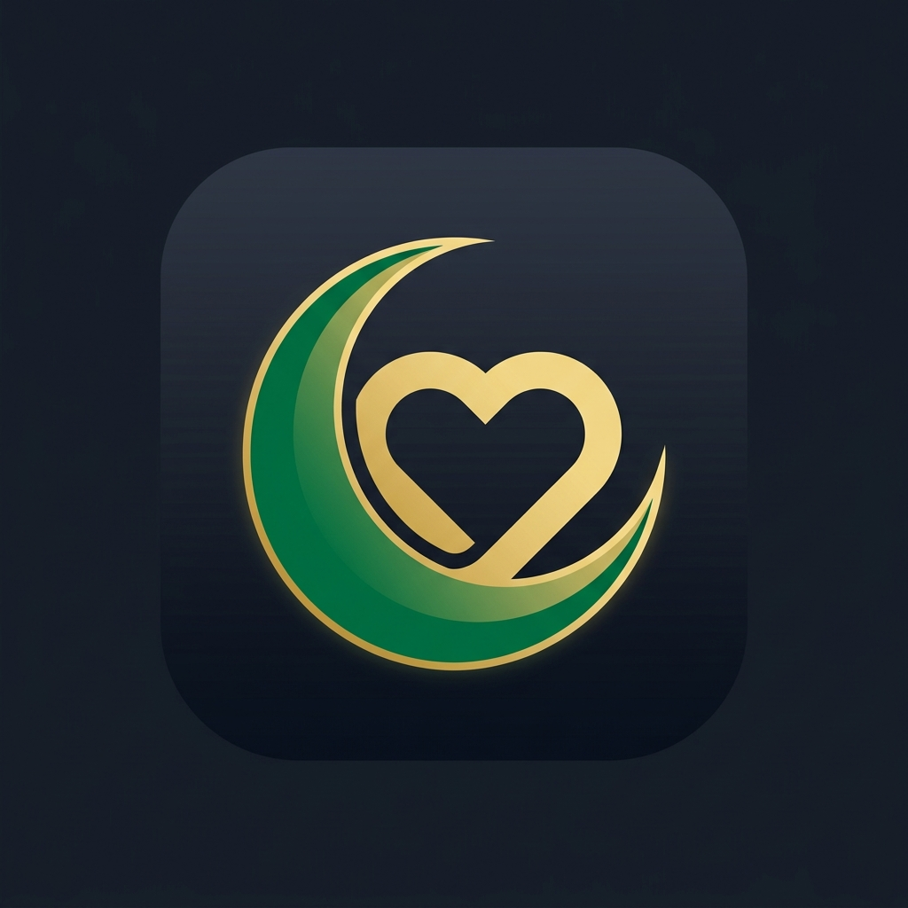
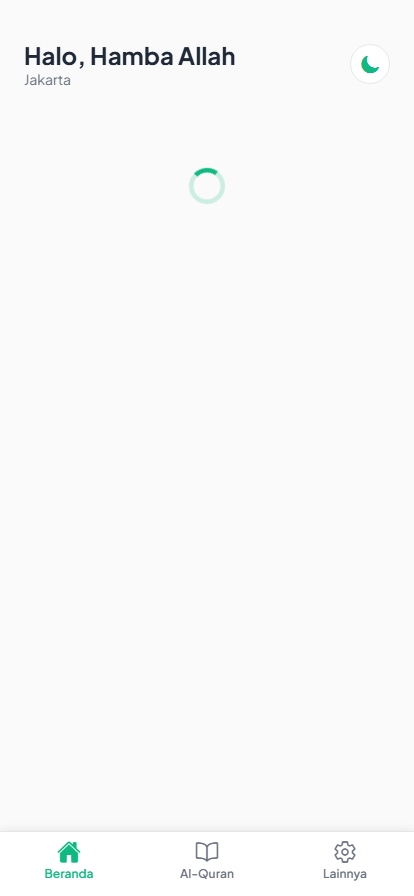
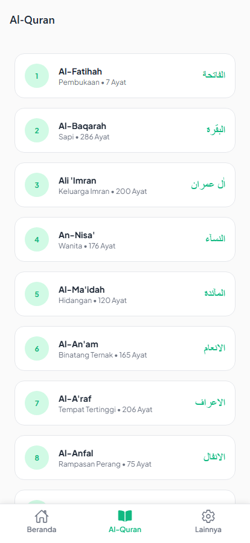
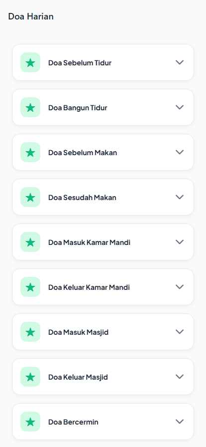
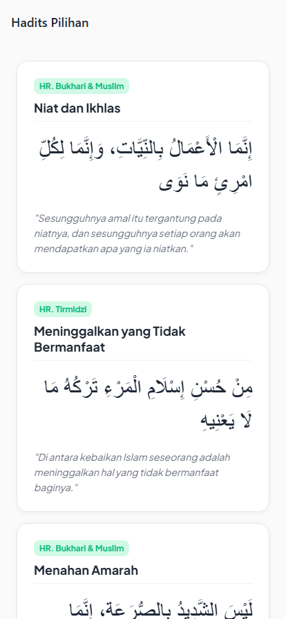
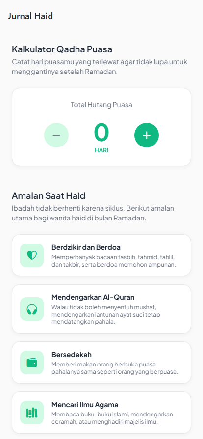
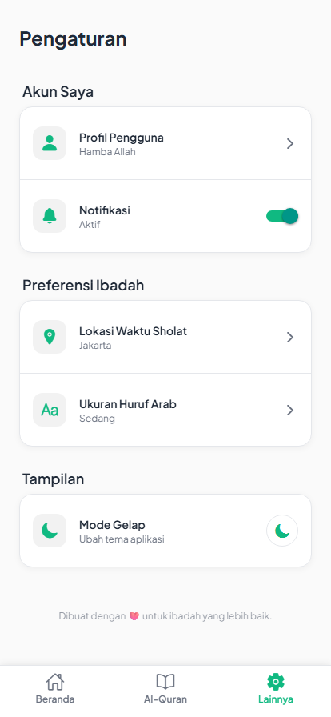

  

<h1 align="center">Qalbu</h1>

  A comprehensive Islamic application built with React Native (Expo). Provides highly accurate dynamic prayer times, offline-first Qibla compass, Digital Al-Quran, daily prayers, and an exclusive menstruation tracker (Jurnal Haid) for women.

  
  
  

---

## Preview

Below are the screenshots showcasing the application's clean, modern, and accessible user interface.

### Home & Dashboard
The main dashboard provides dynamic prayer schedules based on the user's location, a progress tracker for Ramadan, and quick action menus for primary features.

  

### Digital Al-Quran
A beautifully formatted Quran reader fetching real-time data from equran.id API, featuring customizable Arabic font sizes for better readability.

  

### Daily Prayers & Selected Hadith
An offline-first collection of essential daily prayers and selected Hadith, loading instantly via local JSON data.

  
  &nbsp;&nbsp;&nbsp;&nbsp;
  

### Menstruation Tracker (Jurnal Haid)
An inclusive feature designed to help women track missed fasting days (Qadha) and discover alternative acts of worship during their cycle.

  

### Advanced Settings
A highly customizable user experience allowing users to toggle Dark Mode, adjust Arabic font sizes, and modify prayer calculation parameters.

  

---

## Technical Overview

- **Framework:** Expo (React Native)
- **Language:** TypeScript
- **State Management:** React Context API & AsyncStorage
- **APIs:** equran.id (Quran Data), custom prayer times API
- **Device Sensors:** expo-sensors (Magnetometer for Qibla), expo-location (GPS)

## Running Locally

1. Clone the repository
2. Run `npm install` to install dependencies
3. Execute `npx expo start` to launch the Expo development server
4. Connect via the Expo Go app on your physical device, or use an emulator.
